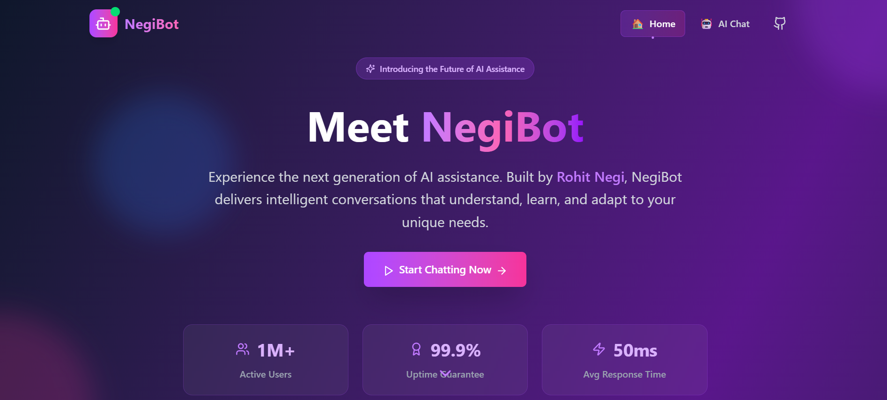

---

````markdown
# 🤖 NegiBot — Your Dev Mentor Inspired by Rohit Negi




**NegiBot** is your personal AI mentor — a chatbot modeled after **Rohit Negi**, the ex-Uber engineer who secured a ₹2 Cr placement from IIT Guwahati. Whether you're stuck on a project, need motivation, or want career advice, **NegiBot** responds just like Rohit: clear, practical, bilingual (🇮🇳 Hindi + 🇬🇧 English), and full of developer energy.

> 🔥 Chat like Rohit Negi. Coming soon: Real voice-based assistant powered by free TTS & voice cloning.

---

## 🚀 Features

- 💬 Real-time chatbot powered by **Google Gemini 2.0 Flash**
- 🧠 Replies in Rohit Negi’s thinking style — first principles + clear explanations
- 🌐 Bilingual responses in **Hindi + English**
- 🎤 (Upcoming) Rohit Negi voice clone for audio replies


---

## 🧱 Tech Stack

| Layer       | Technology                       |
|-------------|----------------------------------|
| Frontend    | React.js, Tailwind CSS, Vite     |
| Backend     | Node.js, Express.js              |
| AI Model    | Google Generative AI (Gemini 2.0)|


---

## 🖥️ Screenshots

| Chat UI | Banner |
|--------|--------|
| [Chat UI](./assets/Negibot-chat.png) |

---

## ⚙️ Installation & Setup

### 1. Clone the repository

```bash
git clone https://github.com/your-username/negibot.git
cd negibot
````

---

### 2. Setup the Backend

```bash
cd backend
npm install
```

Create a `.env` file in `backend/` with:

```
PORT_NO=3000
GEMINI_API_KEY=your_gemini_api_key_here
```

Run backend:

```bash
npm start
```
---

### 3. Setup the Frontend

```bash
cd ../frontend
npm install
npm run dev
```

---

## 📌 Coming Soon

* 🎙️ Mic input + audio response with Rohit Negi-like voice
* 💡 Auto context memory via Redis
* 🚀 Hosted version on Vercel/Render

---


## 🙋‍♂️ Made by

**Gopal Jha**
🐦 Inspired by [Rohit Negi](https://x.com/rohit_negi9)
---


> 💡 Tip: Star this repo if you like it & spread dev energy like Rohit Negi 🚀
> 🏆 Built for a hackathon with ❤️ and ambition

```

